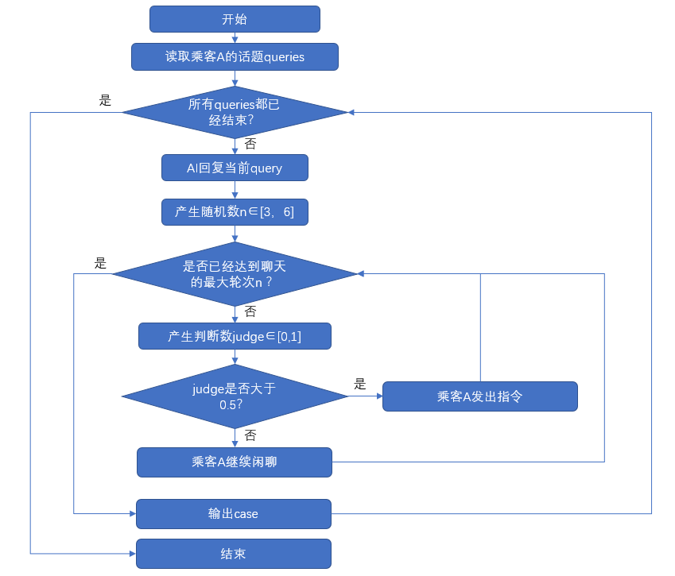

##  行驶车辆场景下人机对话生成
### 项目简介
应用LangChain框架，以qwen-plus与GPT4o为基底，构建了行驶车辆场景下，人类与车机的对话。本项目生成的数据集标注了“闲聊”与“命令”，可以用于模型与训练。(尝试过InternLM，但似乎适配不了LangChain的调用泛式，会报错。)
### 文件结构                 
DialogueGeneration  
├─ command.json                
├─ config.py                   
├─ generation.py               
├─ output.json                 
├─ queries.txt                 
└─ README.md
  
### 文件说明
人类指令样例：
```
[
    [
        "打开车窗",
        "关上它"
    ],
    [
        "空调温度调低到22度",
        "再低一点",
        "设为最低"
    ],
    [
        "打开座椅加热",
        "再热一点",
        "关闭加热"
    ],
]
```
首句提问样例（50条）：
```
【乘客】这车流怎么这么慢。
【乘客】今天的天气真是好得让人心情飞扬。
【乘客】最近工作压力山大，感觉有点喘不过气来。
【乘客】刚刚听到的那首歌，旋律超美的。
【乘客】最近睡眠质量很差，一闭眼就做梦。
【乘客】上周去爬山，景色美极了。
```
### 流程图：


### 需求
需要创建.env文件，用于填写API与URL
qwen不需要URL，如果使用其他LLM可以手动更改
```
DASHSCOPE_API_KEY=sk-xxx
OPENAI_API_KEY=sk-xxx
OPENAI_BASE_URL==https://XXX
```